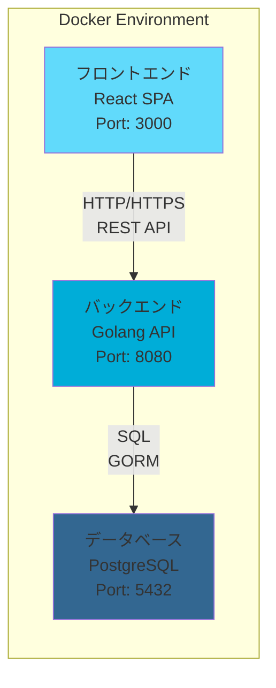

# デザイン文書

## 概要

複数クレジットカード対応家計簿アプリは、Webベースのシングルページアプリケーション（SPA）として設計します。フロントエンドとバックエンドを分離したRESTful APIアーキテクチャを採用し、リレーショナルデータベースでデータを永続化します。

## アーキテクチャ

### システム全体構成



### 技術スタック

**フロントエンド:**
- React 18 with TypeScript
- React Router for SPA routing
- Axios for HTTP client
- Chart.js for data visualization
- Tailwind CSS for styling
- Dark/Light theme support
- Responsive design (Mobile/Tablet/Desktop)
- Color picker components

**バックエンド:**
- Go 1.23+ (Docker: golang:1.23-alpine)
- Gin Web Framework for HTTP routing
- GORM for database ORM
- golang-migrate for database migrations
- validator/v10 for input validation
- bcrypt for password hashing

**データベース:**
- PostgreSQL 15
- Connection pooling with pgxpool

**開発・デプロイ:**
- Vite for frontend build
- Docker for containerization
- Environment-based configuration

## コンポーネントとインターフェース

### フロントエンドコンポーネント構成

```
App
├── Header (ナビゲーション)
├── Router
│   ├── Dashboard (ダッシュボード)
│   ├── ExpenseList (支出一覧)
│   ├── ExpenseForm (支出登録・編集)
│   ├── CardManagement (カード管理)
│   ├── CategoryManagement (カテゴリ管理)
│   └── Reports (レポート)
└── Footer
```

### バックエンドAPI設計

**RESTful API エンドポイント:**

```
GET    /api/cards              # カード一覧取得
POST   /api/cards              # カード作成
PUT    /api/cards/:id          # カード更新
DELETE /api/cards/:id          # カード削除

GET    /api/categories         # カテゴリ一覧取得
POST   /api/categories         # カテゴリ作成
PUT    /api/categories/:id     # カテゴリ更新
DELETE /api/categories/:id     # カテゴリ削除

GET    /api/expenses           # 支出一覧取得（フィルタ対応）
POST   /api/expenses           # 支出作成
PUT    /api/expenses/:id       # 支出更新
DELETE /api/expenses/:id       # 支出削除

GET    /api/reports/monthly    # 月次レポート
GET    /api/reports/yearly     # 年次レポート
```

### データ構造体 (Go Structs)

**Card Model:**
```go
type Card struct {
    ID        string    `json:"id" gorm:"type:uuid;primary_key;default:gen_random_uuid()"`
    Name      string    `json:"name" gorm:"not null" validate:"required,max=100"`
    Color     string    `json:"color" gorm:"not null;default:#3B82F6" validate:"required,hexcolor"`
    CreatedAt time.Time `json:"createdAt" gorm:"autoCreateTime"`
    UpdatedAt time.Time `json:"updatedAt" gorm:"autoUpdateTime"`
}
```

**Category Model:**
```go
type Category struct {
    ID        string    `json:"id" gorm:"type:uuid;primary_key;default:gen_random_uuid()"`
    Name      string    `json:"name" gorm:"not null;unique" validate:"required,max=50"`
    Color     string    `json:"color" gorm:"not null;default:#10B981" validate:"required,hexcolor"`
    IsShared  bool      `json:"isShared" gorm:"not null;default:false"`
    CreatedAt time.Time `json:"createdAt" gorm:"autoCreateTime"`
    UpdatedAt time.Time `json:"updatedAt" gorm:"autoUpdateTime"`
}
```

**Expense Model:**
```go
type Expense struct {
    ID          string    `json:"id" gorm:"type:uuid;primary_key;default:gen_random_uuid()"`
    Amount      float64   `json:"amount" gorm:"not null;check:amount > 0" validate:"required,gt=0"`
    Date        time.Time `json:"date" gorm:"not null" validate:"required"`
    Description string    `json:"description"`
    CardID      string    `json:"cardId" gorm:"not null" validate:"required,uuid"`
    CategoryID  string    `json:"categoryId" gorm:"not null" validate:"required,uuid"`
    Card        Card      `json:"card,omitempty" gorm:"foreignKey:CardID;constraint:OnDelete:CASCADE"`
    Category    Category  `json:"category,omitempty" gorm:"foreignKey:CategoryID;constraint:OnDelete:RESTRICT"`
    CreatedAt   time.Time `json:"createdAt" gorm:"autoCreateTime"`
    UpdatedAt   time.Time `json:"updatedAt" gorm:"autoUpdateTime"`
}
```

## データモデル

### データベーススキーマ

**cards テーブル:**
```sql
CREATE TABLE cards (
  id UUID PRIMARY KEY DEFAULT gen_random_uuid(),
  name VARCHAR(100) NOT NULL,
  color VARCHAR(7) NOT NULL DEFAULT '#3B82F6',
  created_at TIMESTAMP DEFAULT CURRENT_TIMESTAMP,
  updated_at TIMESTAMP DEFAULT CURRENT_TIMESTAMP
);
```

**categories テーブル:**
```sql
CREATE TABLE categories (
  id UUID PRIMARY KEY DEFAULT gen_random_uuid(),
  name VARCHAR(50) NOT NULL UNIQUE,
  color VARCHAR(7) NOT NULL DEFAULT '#10B981',
  is_shared BOOLEAN NOT NULL DEFAULT FALSE,
  created_at TIMESTAMP DEFAULT CURRENT_TIMESTAMP,
  updated_at TIMESTAMP DEFAULT CURRENT_TIMESTAMP
);
```

**expenses テーブル:**
```sql
CREATE TABLE expenses (
  id UUID PRIMARY KEY DEFAULT gen_random_uuid(),
  amount DECIMAL(10,2) NOT NULL CHECK (amount > 0),
  date DATE NOT NULL,
  description TEXT,
  card_id UUID NOT NULL REFERENCES cards(id) ON DELETE CASCADE,
  category_id UUID NOT NULL REFERENCES categories(id) ON DELETE RESTRICT,
  created_at TIMESTAMP DEFAULT CURRENT_TIMESTAMP,
  updated_at TIMESTAMP DEFAULT CURRENT_TIMESTAMP
);
```

### インデックス設計

```sql
-- 支出検索の高速化
CREATE INDEX idx_expenses_date ON expenses(date DESC);
CREATE INDEX idx_expenses_card_id ON expenses(card_id);
CREATE INDEX idx_expenses_category_id ON expenses(category_id);
CREATE INDEX idx_expenses_date_card ON expenses(date DESC, card_id);

-- レポート生成の高速化
CREATE INDEX idx_expenses_date_amount ON expenses(date, amount);

-- 共通フラグ検索の高速化
CREATE INDEX idx_categories_is_shared ON categories(is_shared);
```

### 初期データ

```sql
-- デフォルトカテゴリ
INSERT INTO categories (name, color) VALUES
('食費', '#EF4444'),
('交通費', '#3B82F6'),
('娯楽費', '#8B5CF6'),
('光熱費', '#F59E0B'),
('その他', '#6B7280');
```

## エラーハンドリング

### フロントエンドエラーハンドリング

**Error Boundary:**
```typescript
class ErrorBoundary extends React.Component {
  // アプリケーション全体のエラーをキャッチ
  // ユーザーフレンドリーなエラーメッセージを表示
}
```

**API エラーハンドリング:**
```typescript
// HTTP ステータスコード別のエラー処理
// ネットワークエラーの処理
// タイムアウトエラーの処理
```

### バックエンドエラーハンドリング

**エラーレスポンス形式:**
```go
type ErrorResponse struct {
    Error struct {
        Code    string      `json:"code"`
        Message string      `json:"message"`
        Details interface{} `json:"details,omitempty"`
    } `json:"error"`
    Timestamp string `json:"timestamp"`
    Path      string `json:"path"`
}
```

**エラー分類:**
- 400: バリデーションエラー
- 404: リソース未発見
- 409: データ競合エラー
- 500: サーバー内部エラー

## テスト戦略

### フロントエンドテスト

**単体テスト (Jest + React Testing Library):**
- コンポーネントの描画テスト
- ユーザーインタラクションテスト
- カスタムフックのテスト

**統合テスト:**
- API通信を含むコンポーネントテスト
- ルーティングテスト

**E2Eテスト (Playwright):**
- 主要なユーザーフローのテスト
- 支出登録から一覧表示までの一連の流れ

### バックエンドテスト

**単体テスト (Go testing + testify):** (完了)
- モデル層のバリデーション機能テスト
- 境界値テスト、必須フィールド検証
- 日本語テストデータでの検証
- 合計22テストケース

**統合テスト:** (完了)
- リポジトリ層のCRUD操作テスト (7テストケース)
- API エンドポイントの統合テスト (52テストケース)
- httptest を使用したHTTPハンドラーテスト
- エラーハンドリング、制約違反の完全カバレッジ

**テストデータベース:** (完了)
- インメモリSQLiteによる軽量テスト環境
- テスト実行前後の自動データクリーンアップ
- テストケース分離とデータ一貫性保証
- 合計81テストケース、全テストPASS達成

### テストカバレッジ実績

- 単体テスト: 90%以上達成 (22テストケース)
- 統合テスト: 主要機能の100%カバレッジ (59テストケース)
- バックエンドAPI: 全エンドポイント100%テスト済み
- E2Eテスト: 未実装 (今後の拡張予定)

## UI/UX デザイン

### デザインシステム

**カラーパレット:**
- Primary Color: #8142e7 (アクセントカラー)
- Primary Color Variants: 50-950 (Tailwind CSS extended palette)
- Dark Mode: gray-900, gray-800 backgrounds
- Light Mode: gray-50, white backgrounds

**テーマ機能:**
- ライト/ダークテーマ切り替え
- LocalStorage での設定永続化
- システム設定との連動
- スムーズなトランジション

**レスポンシブデザイン:**
- Mobile First approach
- Breakpoints: sm(640px), md(768px), lg(1024px), xl(1280px)
- ハンバーガーメニュー (モバイル)
- グリッドレイアウトの最適化

### コンポーネントデザイン

**共通UI要素:**
- Card: 角丸、シャドウ、ホバーエフェクト
- Button: Primary, Secondary, Danger variants
- Modal: バックドロップ、Escapeキー対応、ダークテーマ対応
- Form: バリデーション表示、ローディング状態、ダークテーマ対応
- Alert: Success, Error, Warning, Info types
- Badge: 共通フラグ表示用（青色系）

**カラーピッカー:**
- プリセットカラーボタン (10色)
- カスタムカラーピッカー
- リアルタイムプレビュー

**共通フラグ機能:**
- カテゴリ作成・編集時のチェックボックス
- 共通カテゴリに「共通」または「折半」バッジ表示
- 支出一覧での共通カテゴリ識別
- 月次レポートでの折半額自動計算・表示

**ナビゲーション:**
- アイコン付きメニュー項目
- アクティブ状態の視覚的フィードバック
- テーマ切り替えボタン統合

### アクセシビリティ

**WCAG 2.1 AA準拠:**
- コントラスト比 4.5:1 以上
- キーボードナビゲーション対応
- スクリーンリーダー対応
- フォーカス表示の最適化

**ユーザビリティ:**
- 直感的なアイコン使用
- 一貫性のあるインタラクション
- 適切なローディング表示
- エラーメッセージの明確化